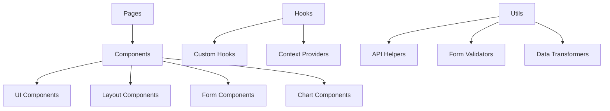
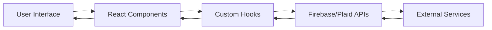

# System Patterns

## Architecture Overview

### Frontend Architecture


### Data Flow


## Key Technical Decisions

### 1. Authentication
- Firebase Authentication for user management
- Custom AuthProvider context
- Protected route middleware
- Session persistence
- Role-based access control

### 2. State Management
- React Context for global state
- Custom hooks for complex logic
- Local state for component-specific data
- Form state with react-hook-form

### 3. Data Validation
- Zod schemas for form validation
- Type-safe data handling
- Runtime validation of API responses
- Custom validation rules

### 4. API Integration
- Firebase SDK for backend services
- Plaid API for bank connections
- RESTful API patterns
- Error handling middleware

### 5. UI Components
- shadcn/ui as component library
- Tailwind CSS for styling
- Responsive design patterns
- Theme customization

## Component Organization

### Directory Structure
```
src/
├── app/                 # Next.js app router pages
├── components/
│   ├── ui/             # shadcn/ui components
│   ├── layout/         # Layout components
│   ├── forms/          # Form components
│   └── charts/         # Data visualization
├── lib/                # Utility functions
├── hooks/              # Custom hooks
├── providers/          # Context providers
└── types/              # TypeScript types
```

### Component Patterns

1. **Page Components**
```typescript
// app/dashboard/page.tsx
export default function DashboardPage() {
  const { user, loading } = useAuth();
  
  if (loading) return <LoadingSpinner />;
  if (!user) redirect('/auth/signin');
  
  return <DashboardLayout>{/* content */}</DashboardLayout>;
}
```

2. **Form Components**
```typescript
// components/forms/BudgetForm.tsx
const formSchema = z.object({
  name: z.string().min(2),
  amount: z.number().positive(),
  category: z.string()
});

export function BudgetForm() {
  const form = useForm<z.infer<typeof formSchema>>({
    resolver: zodResolver(formSchema),
    mode: "onChange"
  });
  
  return <Form {...form}>{/* form fields */}</Form>;
}
```

3. **Layout Components**
```typescript
// components/layout/MainLayout.tsx
export function MainLayout({ children }) {
  return (
    <div className="min-h-screen">
      <Header />
      <Sidebar />
      <main>{children}</main>
      <Footer />
    </div>
  );
}
```

## Data Models

### User Profile
```typescript
interface UserProfile {
  uid: string;
  email: string;
  displayName: string;
  familyId: string;
  role: 'admin' | 'member';
  settings: UserSettings;
}
```

### Transaction
```typescript
interface Transaction {
  id: string;
  amount: number;
  category: string;
  date: Date;
  description: string;
  accountId: string;
  familyId: string;
  createdBy: string;
  receipt?: string;
}
```

### Budget
```typescript
interface Budget {
  id: string;
  name: string;
  amount: number;
  spent: number;
  category: string;
  period: 'monthly' | 'yearly';
  familyId: string;
  shared: boolean;
}
```

## Error Handling

1. **API Errors**
```typescript
try {
  await api.createTransaction(data);
} catch (error) {
  if (error instanceof FirebaseError) {
    toast.error(formatFirebaseError(error));
  } else {
    toast.error('An unexpected error occurred');
  }
}
```

2. **Form Validation**
```typescript
export const transactionSchema = z.object({
  amount: z.number()
    .positive('Amount must be positive')
    .transform(v => Number(v.toFixed(2))),
  description: z.string()
    .min(2, 'Description is required')
    .max(100, 'Description is too long')
});
```

## Performance Optimization

1. **Data Fetching**
- Implement caching strategies
- Use pagination for large datasets
- Optimize Firebase queries
- Implement debouncing for search

2. **Component Optimization**
- Memoization with useMemo/useCallback
- Virtual scrolling for long lists
- Lazy loading of components
- Image optimization

3. **Bundle Optimization**
- Code splitting
- Tree shaking
- Dynamic imports
- Asset optimization 