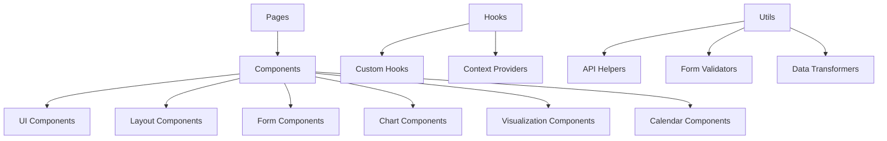
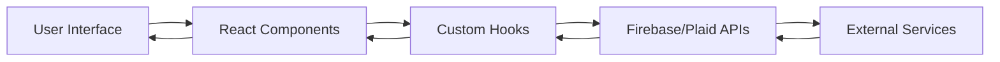

# System Patterns

## Architecture Overview

### Frontend Architecture


### Data Flow


## Key Technical Decisions

### 1. Authentication
- Firebase Authentication for user management
- Custom AuthProvider context
- Protected route middleware
- Session persistence
- Role-based access control

### 2. State Management
- React Context for global state
- Custom hooks for complex logic
- Local state for component-specific data
- Form state with react-hook-form

### 3. Data Validation
- Zod schemas for form validation
- Type-safe data handling
- Runtime validation of API responses
- Custom validation rules

### 4. API Integration
- Firebase SDK for backend services
- Plaid API for bank connections
- RESTful API patterns
- Error handling middleware

### 5. UI Components
- shadcn/ui as component library
- Tailwind CSS for styling
- Responsive design patterns
- Theme customization

### 6. Visualizations
- Component-based visualization system
- Animation with CSS transitions and keyframes
- Interactive elements with state feedback
- Responsive sizing for different devices
- Adaptable visualization types with shared props

### 7. Calendar Integration
- Usage of react-day-picker as base calendar
- Custom day rendering for bills and expenses
- Visual indicators for financial events
- Interactive day selection
- Detailed view for day events
- TypeScript integration with proper prop types

## Component Organization

### Directory Structure
```
src/
├── app/                 # Next.js app router pages
├── components/
│   ├── ui/             # shadcn/ui components
│   ├── layout/         # Layout components
│   ├── forms/          # Form components
│   ├── charts/         # Data visualization
│   ├── calendar/       # Calendar components
│   └── visualizations/ # Interactive visualizations
├── lib/                # Utility functions
├── hooks/              # Custom hooks
├── providers/          # Context providers
└── types/              # TypeScript types
```

### Component Patterns

1. **Page Components**
```typescript
// app/dashboard/page.tsx
export default function DashboardPage() {
  const { user, loading } = useAuth();
  
  if (loading) return <LoadingSpinner />;
  if (!user) redirect('/auth/signin');
  
  return <DashboardLayout>{/* content */}</DashboardLayout>;
}
```

2. **Form Components**
```typescript
// components/forms/BudgetForm.tsx
const formSchema = z.object({
  name: z.string().min(2),
  amount: z.number().positive(),
  category: z.string()
});

export function BudgetForm() {
  const form = useForm<z.infer<typeof formSchema>>({
    resolver: zodResolver(formSchema),
    mode: "onChange"
  });
  
  return <Form {...form}>{/* form fields */}</Form>;
}
```

3. **Layout Components**
```typescript
// components/layout/MainLayout.tsx
export function MainLayout({ children }) {
  return (
    <div className="min-h-screen">
      <Header />
      <Sidebar />
      <main>{children}</main>
      <Footer />
    </div>
  );
}
```

4. **Visualization Components**
```typescript
// components/visualizations/GoalVisualization.tsx
export function GoalVisualization({
  name,
  saved,
  target,
  type = "jar",
  ...props
}) {
  const percentage = Math.min(100, (saved / target) * 100);
  
  return (
    <Card>
      <CardHeader>{name}</CardHeader>
      <CardContent>
        {type === "jar" && <JarVisualization percentage={percentage} />}
        {type === "adventure" && <AdventureMap percentage={percentage} />}
        {/* other visualization types */}
        <Progress value={percentage} />
      </CardContent>
    </Card>
  );
}
```

5. **Calendar Components**
```typescript
// components/calendar/BillsCalendar.tsx
export function BillsCalendar({ 
  bills, 
  expenses,
  onBillClick,
  onExpenseClick 
}) {
  const [selectedDate, setSelectedDate] = useState(new Date());
  
  // Custom day component to show financial info
  const CustomDay = (props: DayProps) => {
    // Day rendering with bills/expenses indicators
    return (
      <div className="...">
        {/* Day content with financial indicators */}
      </div>
    );
  };
  
  return (
    <div className="space-y-4">
      <Calendar
        mode="single"
        selected={selectedDate}
        onSelect={setSelectedDate}
        components={{ Day: CustomDay }}
      />
      {selectedDate && (
        <Card>
          {/* Selected day details with bills and expenses */}
        </Card>
      )}
    </div>
  );
}
```

## Data Models

### User Profile
```typescript
interface UserProfile {
  uid: string;
  email: string;
  displayName: string;
  familyId: string;
  role: 'admin' | 'member';
  settings: UserSettings;
}
```

### Transaction
```typescript
interface Transaction {
  id: string;
  amount: number;
  category: string;
  date: Date;
  description: string;
  accountId: string;
  familyId: string;
  createdBy: string;
  receipt?: string;
}
```

### Budget
```typescript
interface Budget {
  id: string;
  name: string;
  amount: number;
  spent: number;
  category: string;
  period: 'monthly' | 'yearly';
  familyId: string;
  shared: boolean;
}
```

### Savings Goal
```typescript
interface SavingsGoal {
  id: string;
  name: string;
  category?: string;
  saved: number;
  target: number;
  type: 'adventure' | 'jar' | 'envelope' | 'balloon';
  checkpoints?: Array<{
    amount: number;
    label: string;
  }>;
  linkedExpenseId?: string;
  userId: string;
  familyId?: string;
  isShared: boolean;
  createdAt: Date;
  updatedAt: Date;
}
```

### User Settings
```typescript
interface UserSettings {
  theme: 'light' | 'dark' | 'system';
  currency: string;
  notifications: boolean;
  advancedSavingsMode: boolean; // Flag for Advanced Savings and Forecasting
  dashboardLayout: 'default' | 'compact' | 'detailed';
}
```

## Specialized Patterns

### Savings Goal Visualization
- Shared props interface for all visualization types
- Percentage calculation logic
- Status determination (start, progress, near, complete)
- Animation triggers based on state changes
- Theme-aware styling with Tailwind

### Advanced Savings Mode
```typescript
// hooks/useAdvancedSavings.ts
export function useAdvancedSavings() {
  const { profile } = useProfile();
  const { goals } = useGoals();
  
  const isAdvancedMode = profile?.settings?.advancedSavingsMode || false;
  
  const totalBalance = profile?.currentBalance || 0;
  const reservedForGoals = isAdvancedMode 
    ? goals.reduce((sum, goal) => sum + (goal.target - goal.saved), 0)
    : 0;
  const availableBalance = totalBalance - reservedForGoals;
  
  return {
    isAdvancedMode,
    totalBalance,
    reservedForGoals,
    availableBalance
  };
}
```

## Error Handling

1. **API Errors**
```typescript
try {
  await api.createTransaction(data);
} catch (error) {
  if (error instanceof FirebaseError) {
    toast.error(formatFirebaseError(error));
  } else {
    toast.error('An unexpected error occurred');
  }
}
```

2. **Form Validation**
```typescript
export const transactionSchema = z.object({
  amount: z.number()
    .positive('Amount must be positive')
    .transform(v => Number(v.toFixed(2))),
  description: z.string()
    .min(2, 'Description is required')
    .max(100, 'Description is too long')
});
```

## Performance Optimization

1. **Data Fetching**
- Implement caching strategies
- Use pagination for large datasets
- Optimize Firebase queries
- Implement debouncing for search

2. **Component Optimization**
- Memoization with useMemo/useCallback
- Virtual scrolling for long lists
- Lazy loading of components
- Image optimization

3. **Bundle Optimization**
- Code splitting
- Tree shaking
- Dynamic imports
- Asset optimization 

4. **Visualization Optimization**
- Minimal re-renders with useMemo for calculations
- CSS animations over JavaScript for performance
- SVG optimization for adventure map paths
- Conditional rendering of complex animation elements 